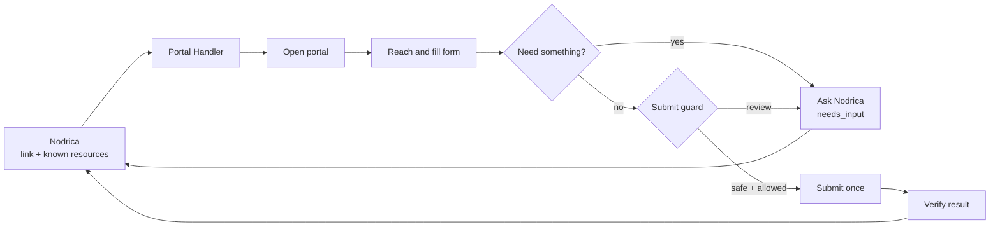
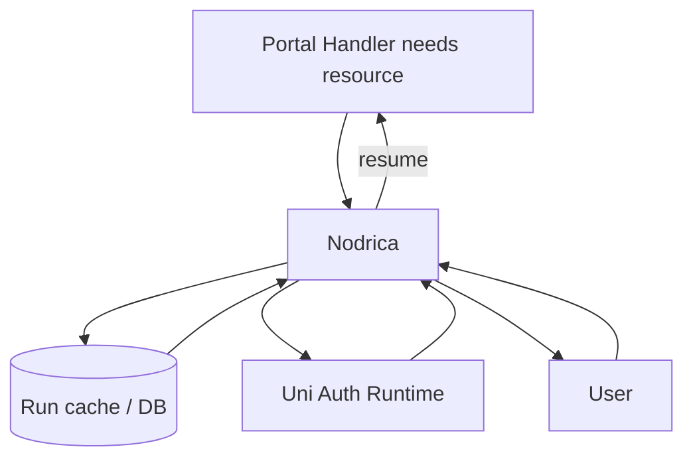

# Portal Application Handler

> A reusable TypeScript + Playwright worker for safely completing supported job-portal applications.

**Status:** visual architecture and implementation plan only—no runtime code yet.

## How it works

## Clear ownership

| Component | Responsibility |
| --- | --- |
| **Portal Handler** | Navigate, fill, pause, resume, guard and verify |
| **Nodrica** | Orchestrate, query DB/cache, ask user and store results |
| **Uni Auth Runtime** | Create, validate and refresh sessions |
| **User** | CAPTCHA/OTP, sensitive answers and approvals |

The handler never accesses Nodrica’s database or the user directly.

## Version-one scope

`Naukri` · `Foundit` · `Internshala` · `Indeed` · `Glassdoor`

Unknown destinations stop as `unsupported_platform`. Auto-submit is off by default.

## Visual documentation

- [Architecture](docs/architecture.md)
- [Nodrica Resource Loop](docs/nodrica-resource-protocol.md)
- [Pause and Resume](docs/contracts-and-continuation.md)
- [Safety and Security](docs/safety-and-security.md)
- [Implementation Roadmap](docs/implementation-plan.md)
- [Decisions](docs/design-decisions.md)

# portal-application-handler
