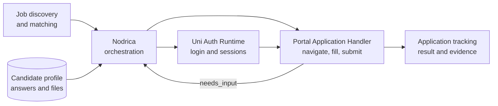
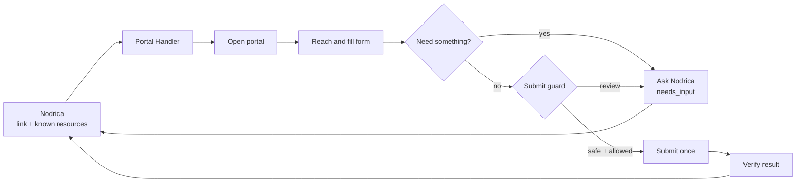
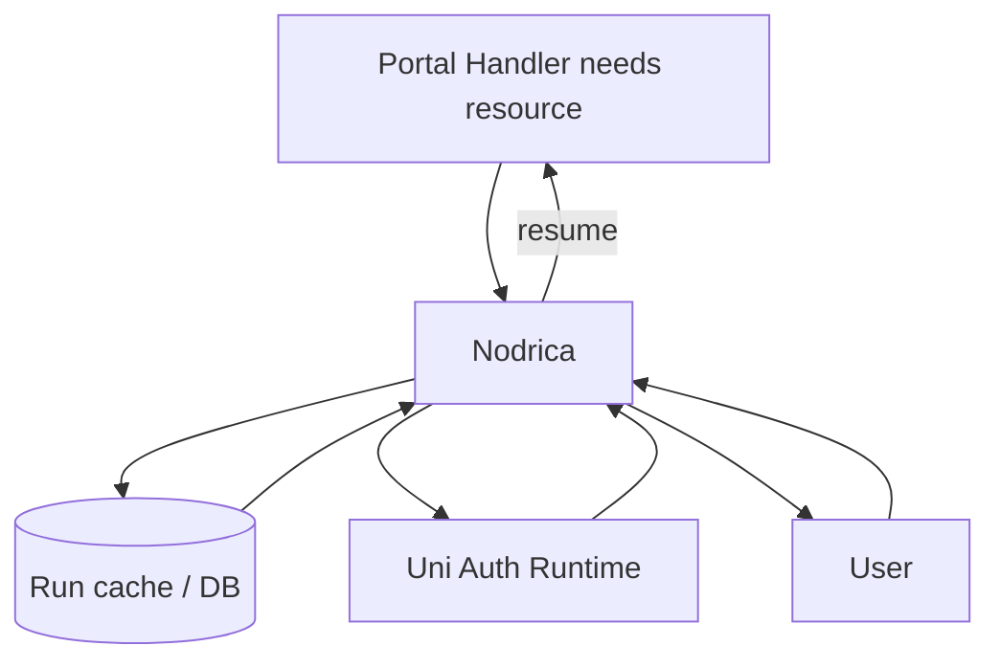

# Portal Application Handler

> The portal-execution component of a larger automated job-application system.

**Status:** version `0.1.0` implementation with fail-closed portal adapters, Nodrica resource requests, live continuation and automated tests.

## Project context

This is **not an independent product**. It is one module in a broader system that discovers suitable jobs, prepares application data, manages authenticated sessions, completes portal forms, asks for missing information, and tracks outcomes.



The module remains reusable and cleanly separated, but its intended home is the complete job-application automation platform.

## How it works



## Clear ownership

| Component | Responsibility |
| --- | --- |
| **Portal Handler** | Navigate, fill, pause, resume, guard and verify |
| **Nodrica** | Orchestrate, query DB/cache, ask user and store results |
| **Uni Auth Runtime** | Create, validate and refresh sessions |
| **User** | CAPTCHA/OTP, sensitive answers and approvals |

Together, these components create one controlled application pipeline; none of them alone represents the full system.



The handler never accesses Nodrica’s database or the user directly.

## Install for development

```bash
npm install
npm run browser:install
npm run validate
```

## Nodrica integration

```ts
const handler = new PortalApplicationHandler({
  headless: false,
  allowedFileRoots: ["/app/approved-application-files"]
});

let result = await handler.start({
  applicationLink,
  sessions: await nodrica.sessions.availableArtifacts(),
  availableData: await nodrica.profile.applicationData(),
  files: await nodrica.files.applicationFiles(),
  policy: { autoSubmit: false }
});

while (result.neededInput && result.continuation) {
  const response = await nodrica.resources.resolve(result.neededInput);
  result = await handler.resume({ continuation: result.continuation, response });
}
```

`nodrica.resources.resolve` checks current run data and approved repositories first, uses Uni Auth Runtime for sessions, and asks the user only when necessary.

## Version-one scope

`Naukri` · `Foundit` · `Internshala` · `Indeed` · `Glassdoor`

Unknown destinations stop as `unsupported_platform`. Auto-submit is off by default.

The built-in adapters use conservative page signals and exact domain lists. Portal interfaces change, so each adapter must pass current sandbox/manual verification before production enablement.

## Visual documentation

- [Architecture](docs/architecture.md)
- [Nodrica Resource Loop](docs/nodrica-resource-protocol.md)
- [Pause and Resume](docs/contracts-and-continuation.md)
- [Safety and Security](docs/safety-and-security.md)
- [Implementation Roadmap](docs/implementation-plan.md)
- [Decisions](docs/design-decisions.md)

# portal-application-handler
