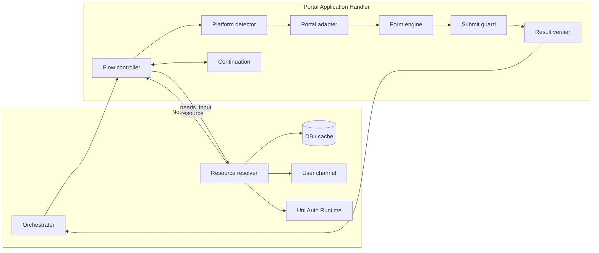
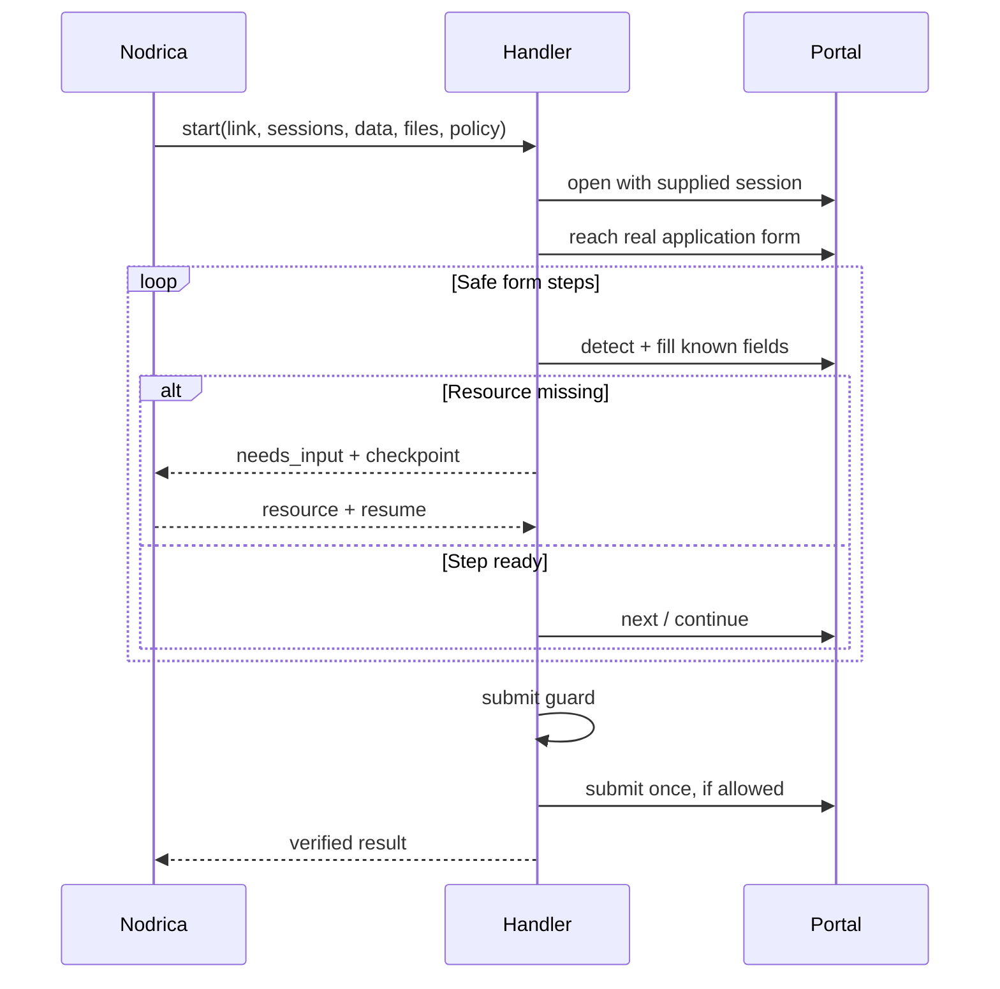
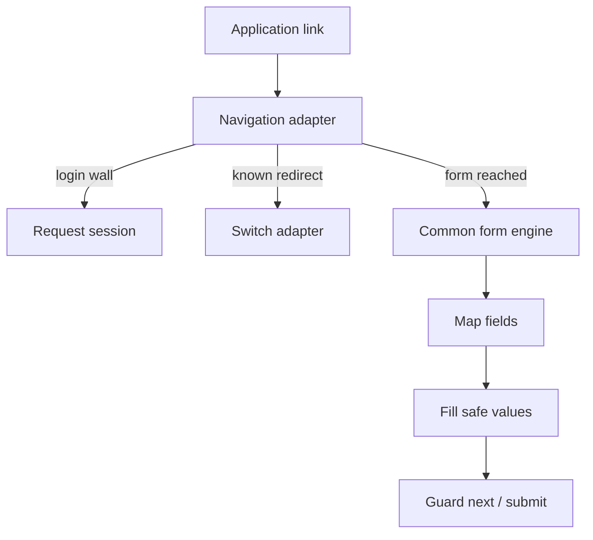
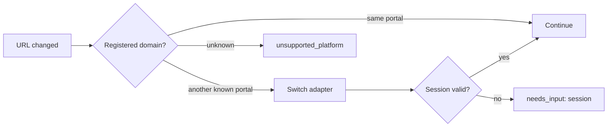

# Architecture

## System map

## One application journey

## Two engines

| Portal-specific | Shared across portals |
| --- | --- |
| Login/apply controls | Field extraction and mapping |
| Already applied/expired detection | Missing-data requests |
| Redirect and form arrival | Step limits and continuation |
| Confirmation signals | Submit safety and result model |

## Redirect rule

Every new top-level domain is re-evaluated. Trust is never inherited through a redirect.

