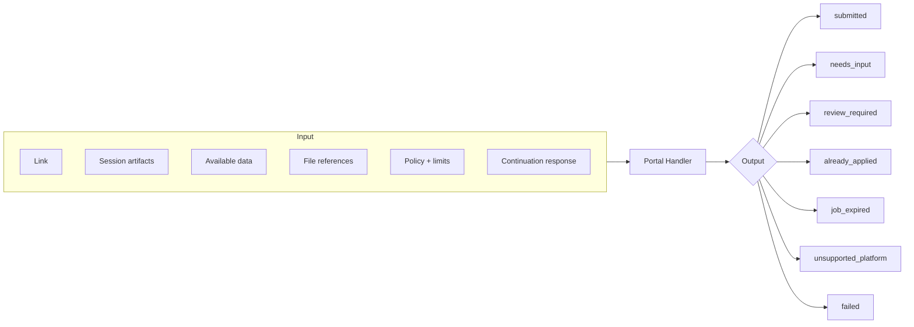
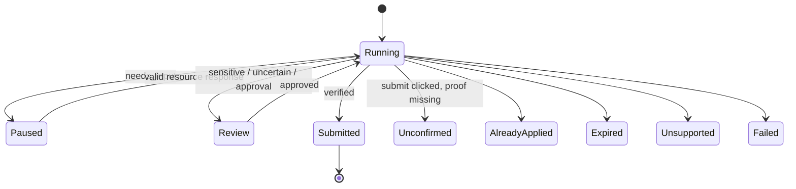
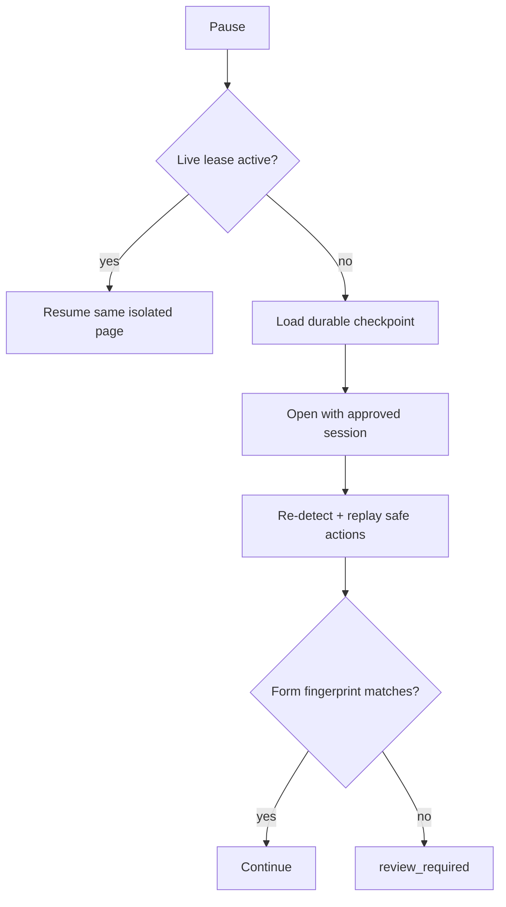
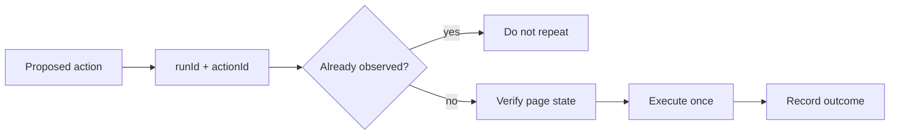

# Contracts and Continuation

## Input → output

Raw passwords are never accepted. Session artifacts remain separate from durable checkpoints.

## Lifecycle

## Hybrid pause and resume

| Live lease | Durable checkpoint |
| --- | --- |
| Opaque run handle | Run/job/provider identifiers |
| Short TTL | Adapter version + safe URL |
| Browser stays isolated | Form fingerprint |
| Best for quick answers | Action IDs + counters |
| Closed on timeout/cancel | Value hashes, never sensitive values |

Never persisted: Playwright objects, DOM handles, cookies, tokens, passwords or raw session state.

## Duplicate-action protection

Final approval is bound to `job + account + form fingerprint + expiry`. `submitted_unconfirmed` is reviewed, never blindly retried.

