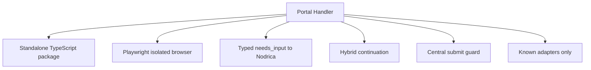
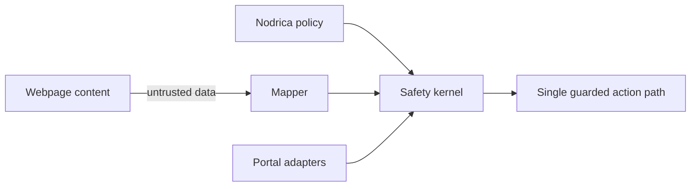

# Design Decisions

## Decision map

| Topic | Final choice |
| --- | --- |
| Repository | `portal-application-handler` |
| Database/UI/login | Owned by Nodrica and Uni Auth Runtime |
| Resource request | Returned result; no direct DB/UI callback |
| Continuation | Short live lease + durable replay checkpoint |
| Auto-submit | Off by default; adapters cannot bypass guard |
| Unknown portal | `unsupported_platform` |
| Initial portals | Naukri, Foundit, Internshala, Indeed, Glassdoor |
| Persistence | None inside package |
| Evidence | Off by default; explicit host policy |
| Concurrency | One browser flow by default |

## Non-negotiable rules

1. Unknown never means safe.
2. Adapters cannot bypass session, domain or submit guards.
3. Webpages cannot reach Nodrica’s DB, tools or secrets.
4. Manual challenges and sensitive decisions are never guessed.
5. Submission is allowed once and independently verified.

## Later—not version one

`AI unknown-site adapter` · `Workday` · `Greenhouse` · `Lever` · `Wellfound` · `LinkedIn` · `direct DB integration` · `distributed browser migration`

