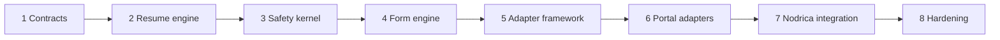
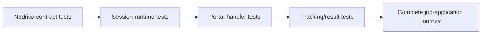
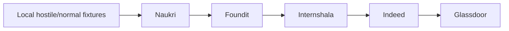
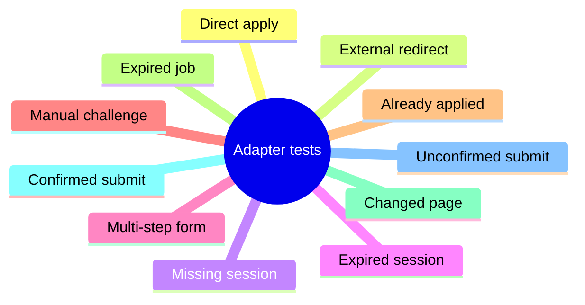
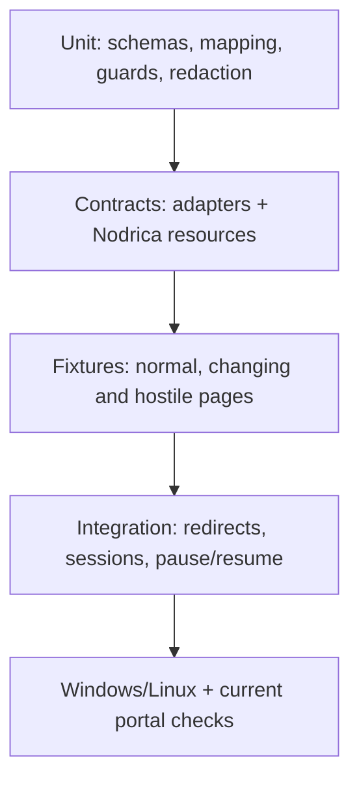
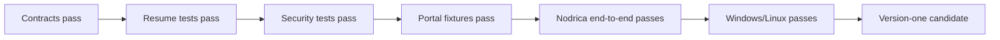

# Implementation Roadmap

This roadmap delivers one module of the wider automated job-application platform. Completion means the module integrates safely with Nodrica, Uni Auth Runtime, candidate data and application tracking—not that it operates as a separate end-user product.

## Build order

## Phases and gates

| Phase | Main deliverables | Must pass before moving on |
| --- | --- | --- |
| **1 Contracts** | Versioned schemas, statuses, errors, limits, field taxonomy | Portal text cannot become DB/tool/policy instructions |
| **2 Resume** | Run machine, live lease, checkpoint, action ledger | Restart/resume never duplicates actions |
| **3 Safety** | Domain/session/browser policies, submit guard | No credentials, bypass, unsafe redirect or unguarded submit |
| **4 Forms** | Extract, map, validate, fill, upload, step control | Unknown/sensitive required fields stop safely |
| **5 Framework** | Detector, adapter switch, selector versions | Adapters cannot bypass the safety kernel |
| **6 Portals** | Fixture adapter, then five real adapters | Each portal passes fixtures and current manual verification |
| **7 Nodrica** | DB/cache/session/user resolution loop | Ask once, reuse safely, no DB credentials in handler |
| **8 Release** | CI, audits, drift signals, operational guide | Security, recovery and Windows/Linux gates pass |

## System integration gate

The module is release-ready only after this complete journey works without leaking responsibilities across component boundaries.

## Portal rollout

Every portal needs these scenarios:

## Test pyramid

## Critical failure matrix

| Test | Safe result |
| --- | --- |
| Portal asks for secrets/DB access | Ignore + unknown/review |
| Wrong or expired account session | `needs_input: session` |
| Unknown redirect/protocol/popup | `unsupported_platform` or blocked |
| Stale/duplicate resource response | Reject |
| Lease expires while paused | Durable replay or review |
| Unknown required field | `needs_input: field_value` |
| Legal/sensitive question | Explicit value + review |
| CAPTCHA/OTP | `needs_input: manual_action` |
| Submit clicked, proof missing | `submitted_unconfirmed` |
| Completed run replayed | No action |
| Cancellation/forced failure | Context and locks cleaned |

## Completion path

## Version-one checklist

- [x] Direct application through a deterministic adapter
- [x] Safe known-platform redirect switching in the central controller
- [x] Missing session/data/file/manual/review request and live resume
- [x] Nodrica DB/cache-first resource contract and integration example
- [x] Uni Auth Runtime-compatible browser-session boundary
- [x] Live continuation, durable checkpoint contract and duplicate-action guard
- [x] Auto-submit off by default and central submit guard
- [x] Distinct verified/unconfirmed/already-applied/expired outcomes
- [x] Prompt-injection, isolation, redirect, redaction and replay guards/tests
- [ ] Windows/Linux and current-portal verification
