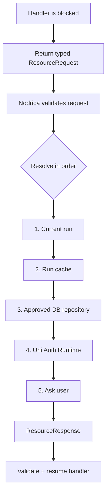
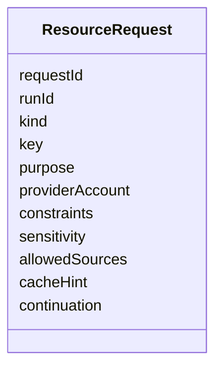
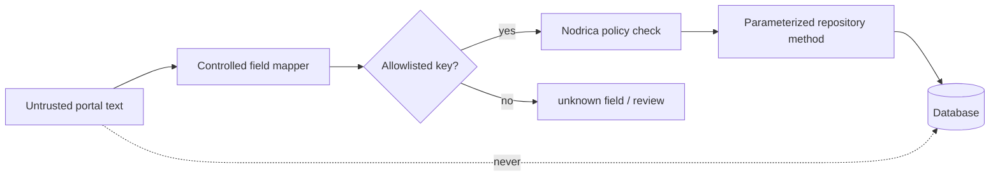
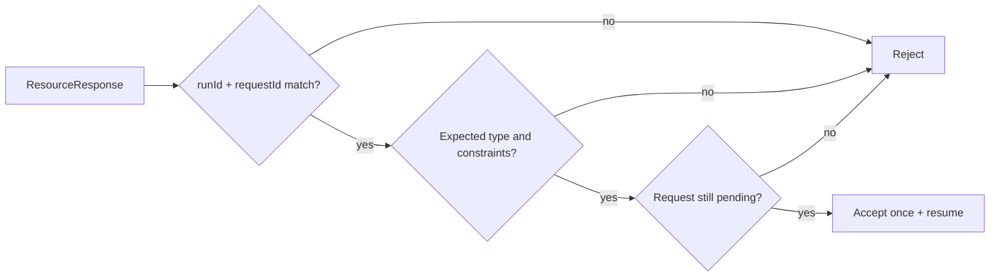

# Nodrica Resource Loop

## “Ask Nodrica” means return—not call

The sequence stops as soon as an approved source resolves the resource.

## Request envelope

| `kind` | Resolved by |
| --- | --- |
| `session` | Session cache → Uni Auth Runtime → user login |
| `field_value` | Run data → profile DB → user |
| `file` | Approved file repository → user |
| `manual_action` | User only |
| `review` | Policy engine → user when required |
| `confirmation` | User or explicit current-run policy |

## Database safety boundary

Portal text can never provide SQL, collection names, paths, prompts or database instructions.

## Response checks

## Reuse policy

| Resource | Default retention |
| --- | --- |
| Valid session | Same run/provider/account |
| Basic profile facts | Run; DB update only by Nodrica policy |
| Job-specific answer | Current job |
| Salary/sponsorship/relocation | Current policy + review |
| Demographic/legal answer | Never infer; normally do not store |
| Submit approval | One form fingerprint, one attempt |

