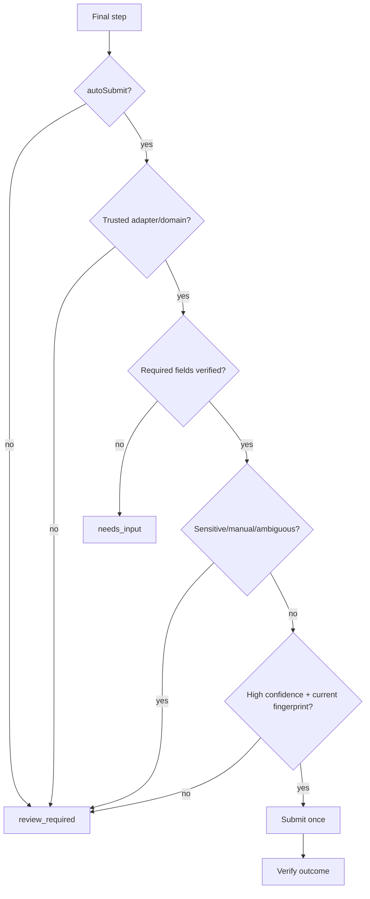
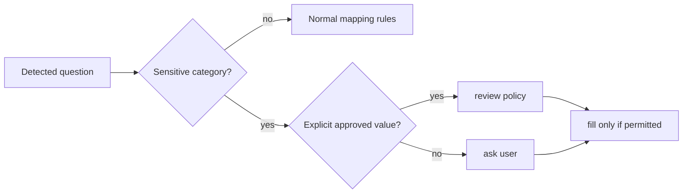
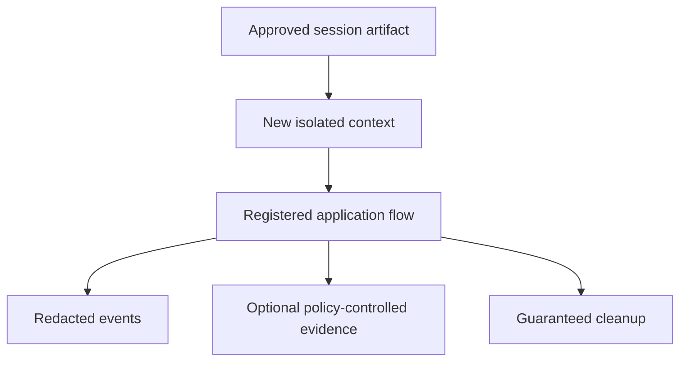

# Safety and Security

## Submit gate

Auto-submit defaults to **off**.

## Threat map

| Risk | Guard |
| --- | --- |
| Portal prompt injection | Portal content is data only; controlled key taxonomy |
| Unsafe redirect | Exact-domain adapter registry + redirect budget |
| Session/account mixing | One isolated context per provider/account |
| Accidental duplicate submit | Action ledger + one-time fingerprinted approval |
| Guessed sensitive answer | Mandatory explicit value/review |
| CAPTCHA/OTP | Pause for user; never bypass |
| Arbitrary file access | Host-approved references + type/size checks |
| PII/secret leakage | Redacted structured logging; evidence off by default |
| Infinite/hostile flow | Time, step, click, redirect, field and upload limits |
| Adapter drift | Versioned selectors + fail-closed unknown state |

## Sensitive-answer route

Sensitive categories: legal declarations, authorization/sponsorship, compensation, disability/demographics, relocation/travel, consent and electronic signatures.

## Browser boundary

- No personal browser profiles or credentials
- No raw sessions in frontend, output or logs
- Popups/downloads/permissions denied unless explicitly scoped
- One application page by default
- Screenshots only for opted-in review/failure policy

Portal terms, rate limits and permitted automation remain the adopter’s responsibility.

